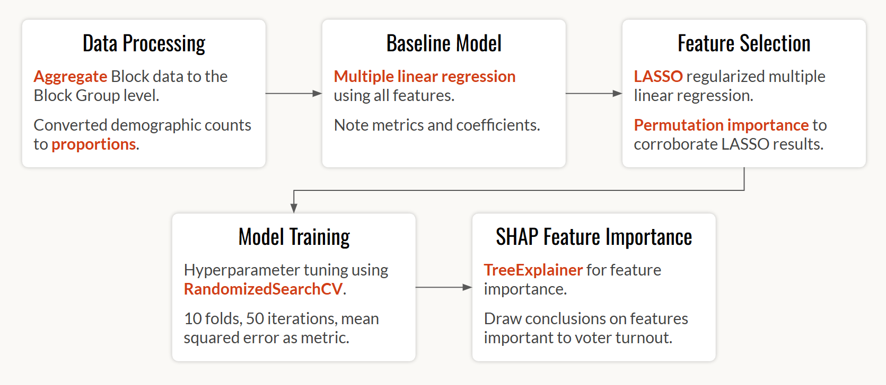

# Voter Turnout and Demographics in Massachusetts

## Project Contributors
- Anitej Thamma
- Max Bahar 
- Stefan Chu 
- Ted McCulloch 

## Structure

The *src* folder contains several Python notebooks with our data processing, EDA, and modeling work. The `utils.py` file contains several functions with the finalized data processing, SHAP feature importance, and model predictions.

The *js* folder contains several JavaScript files that generete the visualizations in the website:
- `barvis.js`: Generates bar plots to visualize distribution of demographics.
- `beeswarm.js`: Generates the SHAP global feature importance beeswarm plot.
- `countyvis.js`: Generates the map that allows users to choose which county to predict.
- `divbarplot.js`: Generates the diverging bar plot, showing distribution of party affiliation across counties.
- `guess.js`: Helper file that handles the user's voter turnout guess.
- `interactionHelper.js`: Helper file that handles various interactions on the website.
- `kdeplot.js`: Generates the kernel density estimate plot showing relationship of voter demographics and turnout.
- `main.js`: Contains the code that instantiates the visualization classes.
- `mapvis.js`: Generates the main map visualization with zooming and tooltip handling. 
- `selectedVariablePreview.js`: Helper file that handles the selection of demographic variables.
- `tooltipLocalImportance.js`: Generates the tooltip with a waterfall plot showing SHAP local feature importance.
- `tooltipvis.js`: Generates the tooltip with the barplot of voter demographics.

## Dependencies

This project relies on the following libraries:
- `GeoPandas`: For manipulation and processing of geographic data. 
- `NumPy`: For its various uses in data manipulation.
- `SHAP`: To assess feature importance.
- `scikit-learn`: For the models, metrics, and scaling.

Data processing and plotting functions can be found in the `utils.py` file.

## Data

The raw data files utilized for this project are:
- `MA_l2_2022stats_2020block` (2022 voter turnout data for MA census blocks)
- `ma_pl2020_b` (Shapefile for 2020 MA Census Blocks)
- `ma_pl2020_bg` (Shapefile for 2020 MA Census Block Groups)
- `ma_pl2020_t` (Shapefile for 2020 MA Census Tracts)
- `ma_pl2020_cnty` (Shapefile for 2020 MA Counties)

## Model Illustration

This is an illustration of the model's workflow:

